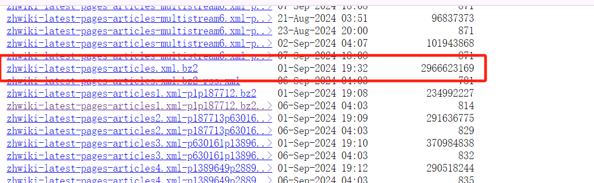

# wikicorpus
维基百科中文语料生成。

### 1 维基百科中文词条文件下载
* 下载地址：[维基百科中文词条文件下载](https://dumps.wikimedia.org/zhwiki/latest/)
* 下载文件：zhwiki-latest-pages-articles.xml.bz2

### 2 维基百科中文语料生成
#### 2.1 提取 wiki_extractor
解析词条文件内容，提取词条
1. 词条文件解析：文件内容为 xml 格式，使用 xml.etree 解析
2. 提取结果：词条标题, 词条内容, 词条id

#### 2.2 清洗 wiki_cleaner
清洗提取的词条数据，主要清洗的对象是 词条内容
1. 繁体转为简体：词条内容包含繁体中文和简体中文，使用 opencc 转换为简体中文
2. 词条内容解析：词条内容为 Wikitext 格式，使用 mwparserfromhell 解析并进行处理
3. 其他清洗规则：正则替换指定字符、去除空格、合并多个换行等等

#### 2.3 生成 wiki_generator
读取词条文件，经过提取、清洗等操作后生成语料文件
1. 读取词条文件：文件为 bz2 格式，使用 bz2file 读取词条文件
2. 提取词条数据：wiki_extractor
3. 生成语料文件：生成的文件格式为 jsonl 格式，每一行为一条语料数据，格式为：{"id": "词条id", "title": "词条标题", "content": "词条内容"}
